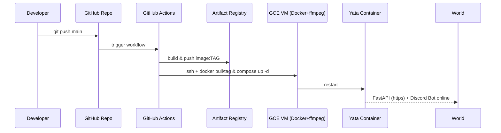

# サーバー公開と最小設定手順

## 0. このドキュメントで得られるもの
GitHub の **main ブランチへ push** すると、自動的に

1. GitHub Actions が Docker イメージをビルドし Artifact Registry へ push
2. GCP Compute Engine VM 上で最新イメージを pull & 再起動
3. Discord Bot + FastAPI (port **8000**) が即時リプレイス

までが **完全自動化** されます。各ステップで *なぜ* それを行うのかも解説するため、クラウド / CI‒CD 初学者でも仕組みを理解しながら進められます。

---
## 1. 全体の流れ (Bird-Eye View)


## 1.1 CD で使う GCP サービスの役割
| サービス / 機能 | この CD フローで何をするか |
|----------------|-----------------------------------------------------------|
| **Artifact Registry** | GitHub Actions がビルドした Docker イメージを push。VM 側は pull して再起動。|
| **Secret Manager** | Discord/OpenAI トークンや `client_secret.json` を安全に保存し、VM 起動時に環境変数として読み込む。|
| **Service Account `yata-deployer`** | GitHub Actions が impersonate し、Artifact Registry への push や Compute Engine API 操作を実行。|
| **IAM ロール** |・Artifact Registry Writer<br/>・Compute OS Login<br/>・Compute Instance Admin (v1)<br/>・Service Account Token Creator<br/>・Service Account User | 各ロールが許可する具体的 API: push/pull、SSH (OS Login)、VM 更新、SA トークン発行（インパーソネート）。|
| **Workload Identity Federation** | GitHub OIDC トークン → 一時 SA トークンに交換し、秘密鍵レスで GCP 認証を実現。|
| **Identity Pool / Provider** | 上記 WIF の「入口」設定。issuer=`token.actions.githubusercontent.com`, `attribute.repository` 制限。|
| **Compute Engine VM** | 本番環境。startup-script で Docker + ffmpeg をセットアップ、docker compose で Bot + FastAPI を稼働。|
| **静的 IP & DNS / TLS** | VM への固定エンドポイントを提供し、Nginx + Certbot で HTTPS を終端。|

---
## 2. 事前準備 (一度だけ)

| 項目 | 要点 | 参考 |
|------|------|------|
| **GCP Project** | `gcloud projects create` or 既存プロジェクトを使用 | |
| **API 有効化** | Compute Engine, Artifact Registry, Secret Manager | `gcloud services enable compute.googleapis.com artifactregistry.googleapis.com secretmanager.googleapis.com` |
| **サービスアカウント** | `yata-deployer` (後述 WIF 用) | |
| **Artifact Registry** | リポジトリ `yata-agent` (Docker) | `gcloud artifacts repositories create yata-agent --repository-format=docker --location=asia-northeast1` |
| **Secrets** | Discord / OpenAI / Google OAuth クライアント | `gcloud secrets create discord-token --data-file=-` など |
| **DNS & TLS** | `example.com` を A レコードで VM IP に向け、Certbot で証明書取得 | |

### 2.1 具体的な準備ステップ
以下では **Cloud Shell から 10 分以内** で完了する最小コマンド例を示します。`<PROJECT_ID>` や `<DOMAIN>` は適宜読み替えてください。

#### (1) API を有効化
```bash
PROJECT=<PROJECT_ID>
gcloud config set project $PROJECT
gcloud services enable \
  compute.googleapis.com \
  artifactregistry.googleapis.com \
  secretmanager.googleapis.com
```
> *なぜ?* これらの API が無効だと CLI でリソースを作成できず、後続コマンドが失敗します。

**🍀 ブラウザ UI での手順**
1. Cloud Console 左上のハンバーガーメニュー → **API とサービス → ライブラリ** を開く。
2. `Compute Engine API` を検索して [有効にする] をクリック。
3. 同様に `Artifact Registry API`, `Secret Manager API` も検索 → 有効化。
4. 画面右上のベルアイコンで「有効化完了」の通知を確認。

#### (2) サービスアカウントを作成し、権限付与
```bash
SA=yata-deployer
gcloud iam service-accounts create $SA \
  --description="Deploy from GitHub Actions" \
  --display-name="Yata Deployer"

# 必要ロールを一括で付与
for ROLE in artifactregistry.writer compute.osLogin compute.instanceAdmin.v1 iam.serviceAccountTokenCreator iam.serviceAccountUser; do
  gcloud projects add-iam-policy-binding $PROJECT \
    --member="serviceAccount:${SA}@${PROJECT}.iam.gserviceaccount.com" \
    --role="roles/${ROLE}"
done
```
> *ポイント* : `iam.serviceAccountTokenCreator` は **Workload Identity Federation** で OIDC トークンを SA に変換するために必須です。

**🍀 ブラウザ UI での手順**
1. **IAM と管理 → サービス アカウント** → [サービス アカウントを作成]。
2. 名前に `yata-deployer` を入力し [作成]。
3. 権限付与画面で以下 4 つのロールを検索し追加   
   - Artifact Registry 読み取り/書き込み (`Artifact Registry > Artifact Registry Writer`)   
   - Compute OS Login (`Compute Engine > Compute OS Login`)   
   - Compute インスタンス管理者 (v1)   
   - IAM サービスアカウントトークン作成者
4. [完了] を押して SA を作成。

#### (3) Artifact Registry を作成
```bash
REGION=asia-northeast1
REPO=yata-agent
gcloud artifacts repositories create $REPO \
  --repository-format=docker --location=$REGION \
  --description="Docker repo for Yata Agent"
```
> **region 選択のヒント**: VM と同じリージョンに置くと Pull 時のレイテンシと下り egress コストが抑えられます。

**🍀 ブラウザ UI での手順**
1. Cloud Console → **Artifact Registry** を開く。初回は [リポジトリを作成] が表示。
2. 名前を `yata-agent`, フォーマットを **Docker**, リージョンを `asia-northeast1` に設定。
3. → 推奨設定例
| 項目 | 推奨値 | 理由 |
|------|--------|------|
| 形式 | **Docker** | Yata Agent は Docker イメージを push/pull するため。|
| モード | **標準** | ローカルにイメージを保存。リモート/仮想は他レジストリ参照用。|
| ロケーションタイプ | **リージョン** | VM が asia-northeast1 にあるため同リージョンで低遅延。|
| リージョン | **asia-northeast1 (Tokyo)** | 上記と同じ。|
| 説明 | `Yata Agent Docker images` | 任意のメモ。|
| ラベル | `env=prod` など | あとで課金や検索で便利。|
| 暗号化 | **Google が管理** | 追加コスト不要。KMS を使う場合は組織ポリシーに合わせる。|
| 不変のイメージタグ | **無効** (初学者向け) | tag 上書きを許可。運用で固定が必要なら有効化。|
| クリーンアップ ポリシー | **テストを実行** → 運用が安定したら **アーティファクトを削除** に切替 | まずは削除をシミュレーションして Cloud Audit Logs で影響を確認し、想定通りに動くことを確認後に本削除モードへ移行するのが安全。|
| 脆弱性スキャン | **有効** | 自動で CVE を検出。追加費用なし。|

> これらを UI で選択・入力して **[作成]** をクリックすれば OK。

#### (4) Secret Manager にトークンを格納
```bash
# ディスコード Bot Token
printf '%s' "$DISCORD_TOKEN" | gcloud secrets create discord-token --data-file=-
# OpenAI API Key
printf '%s' "$OPENAI_API_KEY" | gcloud secrets create openai-key --data-file=-
# Google OAuth client_secret.json (ファイルがある場合)
gcloud secrets create gcp-client-json --data-file=client_secret.json
```
> `printf` で改行を入れずに登録するのがコツ。Secrets は **バージョニング** されるので、更新時は `gcloud secrets versions add` を使用。

**🍀 ブラウザ UI での手順**
1. **Security → Secret Manager** を開き [シークレットを作成]。
2. 例: 名前 `discord-token`; 値に Bot Token を貼り付けて [作成]。
3. `openai-key`, `gcp-client-json` も同様に追加。JSON はファイルアップロード可。
4. 作成後、各シークレット → [アクセス権] → `yata-deployer` SA に **Secret Manager Secret Accessor** ロールを付与。

#### (5) Workload Identity Federation のプール & プロバイダ作成
```bash
POOL_ID=github-pool
PROVIDER_ID=github-provider
gcloud iam workload-identity-pools create $POOL_ID \
  --location="global" --display-name="GitHub OIDC Pool"

gcloud iam workload-identity-pools providers create-oidc $PROVIDER_ID \
  --location="global" --workload-identity-pool=$POOL_ID \
  --display-name="GitHub Provider" \
  --issuer-uri="https://token.actions.githubusercontent.com" \
  --attribute-mapping="google.subject=assertion.sub,attribute.repository=assertion.repository"

# SA <-> Provider を関連付け (audience=sts.googleapis.com)
gcloud iam service-accounts add-iam-policy-binding \
  ${SA}@${PROJECT}.iam.gserviceaccount.com \
  --role="roles/iam.workloadIdentityUser" \
  --member="principalSet://iam.googleapis.com/projects/${PROJECT}/locations/global/workloadIdentityPools/${POOL_ID}/attribute.repository/<owner>/<repo>"
```
> ここで `<owner>/<repo>` は GitHub の org/name を指定。これで **秘密鍵レス** で 
GIthub Actions から SA を使えます。

**🍀 ブラウザ UI での手順**
1. **IAM と管理 → Workload Identity フェデレーション** を開き、[プールを作成]。
2. ID `github-pool`, 表示名は任意。作成後 [プロバイダを追加] で **OIDC** を選択。
3. 以下を入力:   
   - 発行元: `https://token.actions.githubusercontent.com`   
   - 属性マッピング: `google.subject=assertion.sub,attribute.repository=assertion.repository`
### 🎛️ プロバイダ追加フォーム詳解
| UI ラベル | 推奨入力値 | 役割・補足 |
|-----------|------------|------------|
| プロバイダの選択 | **OpenID Connect (OIDC)** | GitHub は OIDC トークンを提供するため。|
| プロバイダ名 | `GitHub Provider` | 任意の表示名。後から変更可。|
| プロバイダ ID | `github-provider` | リソース ID。英数字とハイフンのみ、後から変更不可。|
| 発行元 (Issuer URL) | `https://token.actions.githubusercontent.com` | GitHub の固定 OIDC エンドポイント。必ず https で始まる。|
| JWK ファイル | **空欄** | GitHub は公開 JWK を自身でホストしているためアップロード不要。|
| デフォルトのオーディエンス | 自動入力のまま | GitHub Actions 公式が aud にこのリソース名を設定。|
| 許可するオーディエンス | **空欄** (推奨) | デフォルト aud を許可。厳格にする場合のみ追加。|

> **audience を追加すべき？**  
> 初学者は空欄で OK。将来セキュリティを強化したい場合はワークフロー側で `audience:` を指定し、ここにも同じ文字列を追加して絞り込む。

以上を入力し **[作成]** すれば Provider が登録され、そのまま表示される「サービス アカウントの関連付け」ダイアログで `yata-deployer` を選択すると設定が完了します。

4. 作成後、プール詳細画面の [サービス アカウントの関連付け] → `yata-deployer` を選択し、
`attribute.repository` に `<owner>/<repo>` を入力。

**📝 フィールドの意味と入力例**
| UI フィールド | 入力例 | 説明 |
|---------------|---------|------|
| **プール ID** | `github-pool` | 一意な識別子。英数字とハイフンのみ。後から変更不可。|
| **表示名** | `GitHub OIDC Pool` | 管理画面に表示されるだけ。日本語可。|
| **プロバイダ ID** | `github-provider` | プール内で一意な識別子。英数字とハイフン。|
| **発行元 (Issuer URI)** | `https://token.actions.githubusercontent.com` | GitHub が OIDC トークンを発行する固定 URL。|
| **属性マッピング** | `google.subject=assertion.sub,attribute.repository=assertion.repository` | GitHub トークンの claim を GCP 側属性へ転写。`assertion.repository` には `org/repo` が入る。|
| **サービス アカウントの関連付け** | `yata-deployer@<project>.iam.gserviceaccount.com` | この SA を OIDC トークンでインパーソネート可能にする。|
| **条件 (attribute.repository)** | `<owner>/<repo>` | GitHub 側のリポジトリ名を厳密に指定。大文字小文字が区別される点に注意。|

> 例: GitHub リポジトリ `my-org/ai-assistant` の場合は `attribute.repository=="my-org/ai-assistant"` と入力。

#### (6) DNS と TLS
1. ドメインレジストラで `A` レコード → VM の **外部固定 IP** を設定  
   ```bash
   gcloud compute addresses create yata-ip --region=$REGION
   gcloud compute addresses describe yata-ip --region=$REGION  # ← 取得した IP を DNS へ登録
   ```
   **👉 具体的な DNS 設定手順**  
   | 項目 | 入力例 | 補足 |
   |------|--------|------|
   | レコード種別 | **A (IPv4)** | 予約した固定 IP は IPv4 のため A レコードを選択。IPv6 を併用する場合は AAAA も追加。 |
   | ホスト名 (Name / Host / Label) | `@` (ルートドメイン) または `app` | `@` は `example.com` を指す。`app` とすると `app.example.com` になる。 |
   | 値 (Address / Data) | `34.168.xxx.xxx` | 手順 1 で取得した固定 IP を貼り付ける。 |
   | TTL | `300` 秒 (5 分) | 最短〜1 時間程度なら可。頻繁に変えない場合は `3600` でも良い。 |

   **主要レジストラごとの UI 例**  
   - *Google Domains* →「DNS」→「カスタム レコード」→「+ レコードを追加」→ A / `@` / IP / TTL。  
   - *Namecheap* →「Domain List」→「Manage」→「Advanced DNS」→「Add New Record」。  
   - *お名前.com* →「お名前.com Navi」→ 上部メニュー **ネームサーバー/DNS** → **ドメインDNS設定** → 対象ドメインの **DNS 設定** 欄で **DNSレコード設定** をクリック → **レコード追加** タブで `TYPE=A`, `HOST=@` または `app`, `VALUE=34.168.xxx.xxx`, `TTL=300` を入力 → **追加** → **確認画面へ進む** → **設定する** (公式ガイド: <https://www.onamae.com/guide/p/70>)  
   - *Route 53* →「Hosted zones」→ 対象ゾーン →「Create record」。  

   **伝播確認コマンド**  
   ```bash
   # dig でルートドメイン
   dig +short example.com
   # サブドメイン app.example.com
   dig +short app.example.com
   ```  
   数分～最大 24h で `34.168.xxx.xxx` が返るようになれば完了。  

2. VM に **SSH** でログインしたら nginx + Certbot をインストール  
   ```bash
   sudo apt-get update -y
   sudo apt-get install -y nginx certbot python3-certbot-nginx
   ```
   - **nginx** : 80/443 で待受けるリバースプロキシ。
   - **certbot** : Let's Encrypt から TLS 証明書を取得する ACME クライアント。
   - **python3-certbot-nginx** : nginx 設定を自動書き換え／リロードするプラグイン。

   🔒 **Firewall チェック** : GCE で 80・443 番ポートが許可されているか確認し、無ければ作成。
   ```bash
   gcloud compute firewall-rules create allow-http  --allow=tcp:80  --target-tags=https-server
   gcloud compute firewall-rules create allow-https --allow=tcp:443 --target-tags=https-server
   ```

3. Certbot で TLS 証明書を取得し nginx を自動設定  
   ```bash
   sudo certbot --nginx \
     -d <DOMAIN> -m <MAIL> \
     --agree-tos --non-interactive
   ```
   例:
   ```bash
   sudo certbot --nginx \
  -d agent.humaniste.site \
  -m ushida.yosei@gmail.com \
  --agree-tos --non-interactive
   ```
   - `--nginx` を付けると Certbot が server ブロックを検出し、`ssl_certificate` などを自動注入後に `nginx -s reload` を実行。  
   - 証明書は `/etc/letsencrypt/live/<DOMAIN>/` に保存。  
   - 自動更新は `systemctl status certbot.timer` で確認できる（60 日ごとに更新実行）。

4. nginx で FastAPI (port **8000**) へプロキシ  
   Certbot 実行後に生成された `/etc/nginx/sites-enabled/default` の **SSL 用 server ブロック** を編集し、`location /` を下記へ置換。  
   ```nginx
   location / {
       proxy_pass http://127.0.0.1:8000;
       proxy_set_header Host $host;
       proxy_set_header X-Real-IP $remote_addr;
       proxy_set_header X-Forwarded-For $proxy_add_x_forwarded_for;
       proxy_set_header X-Forwarded-Proto $scheme;
   }
   ```
   変更後は構文チェック → リロード。  
   ```bash
   sudo nginx -t && sudo systemctl reload nginx
   ```
   ここまで完了し `https://<DOMAIN>/health` が 200 を返せば HTTPS 化は成功です。  
   
   **トラブルシューティング**  
   | 症状 | 原因 | 対応 |
   |------|------|------|
   | HTTP challenge が失敗 | DNS 伝播前／80 番閉塞 | `dig` で A レコード確認、FW ルールを再確認 |
   | 443 接続不可 | Firewall or nginx stop | `sudo lsof -i:443`, `systemctl status nginx`|
   | 証明書期限切れ | certbot.timer 無効 | `sudo certbot renew --dry-run` で手動チェック |
   | `iam.serviceAccounts.getAccessToken` 403 | WIF 設定ミス / principalSet 未付与 | `gcloud iam service-accounts add-iam-policy-binding <SA> --role=roles/iam.workloadIdentityUser --member="principalSet://iam.googleapis.com/projects/<PROJECT_NUMBER>/locations/global/workloadIdentityPools/<POOL_ID>/attribute.repository/<OWNER>/<REPO>"` を実行して SA と GitHub リポジトリを正しく紐付ける。PowerShell 例は下記参照。 |
   | `failed to read dockerfile: open Dockerfile: no such file or directory` | Linux ランナーは **大文字小文字を区別** するため、リポジトリ内のファイル名が `DockerFile` や `dockerfile` になっている | 1) ファイルを `Dockerfile` にリネームする 2) もしくは workflow の `docker build -f Dockerfile` を実際のファイル名に合わせて修正 |

これで表に記載した事前準備が完了し、次章以降の **VM 構築** と **CI/CD** へ進めます。

---
## 3. VM 構築 (Docker + ffmpeg)
### 3.1 VM 作成
```bash
ZONE=asia-northeast1-a
PROJECT=<PROJECT_ID>
gcloud compute instances create yata-prod \
  --project=$PROJECT --zone=$ZONE \
  --machine-type=e2-small \
  --image-family=ubuntu-2204-lts --image-project=ubuntu-os-cloud \
  --boot-disk-size=30GB --tags=https-server \
  --metadata=startup-script-url=https://raw.githubusercontent.com/HumanisteJP/ai-assistant/main/scripts/startup-install-docker.sh \
  --service-account=yata-deployer@$PROJECT.iam.gserviceaccount.com \
  --scopes=https://www.googleapis.com/auth/cloud-platform \
  --address=yata-ip
```

### 💻 Windows PowerShell 版
```powershell
# ========= ① 変数定義 =========
$PROJECT = "agents-460015"                 # ← ご自分の Project ID
$ACCOUNT = "ushida.yosei@gmail.com"        # ← ご自分の Google アカウント
$ZONE    = "asia-northeast1-a"                 # ポリシーで禁止なら asia-northeast1-a などに変更
$MEMBER  = "user:$ACCOUNT"                 # 変換不要

# ========= ② IAM 権限付与 (1 回だけ) =========
gcloud projects add-iam-policy-binding $PROJECT `
  --member="$MEMBER" `
  --role="roles/compute.instanceAdmin.v1"

gcloud projects add-iam-policy-binding $PROJECT `
  --member="$MEMBER" `
  --role="roles/iam.serviceAccountUser"

# 1) Compute Admin ロールを付与
gcloud projects add-iam-policy-binding $PROJECT `
  --member="$MEMBER" `
  --role="roles/compute.admin"

# ========= ③ VM 作成 =========
gcloud compute instances create "yata-prod" `
  --project=$PROJECT `
  --zone=$ZONE `
  --machine-type="e2-small" `
  --image-family="ubuntu-2204-lts" `
  --image-project="ubuntu-os-cloud" `
  --boot-disk-size="30GB" `
  --tags="https-server" `
  --metadata="startup-script-url=https://raw.githubusercontent.com/HumanisteJP/ai-assistant/main/scripts/startup-install-docker.sh" `
  --service-account="yata-deployer@$PROJECT.iam.gserviceaccount.com" `
  --scopes="https://www.googleapis.com/auth/cloud-platform" `
  --address="yata-ip"
```

### 3.2 startup-install-docker.sh
```bash
#!/usr/bin/env bash
set -eux
# Docker + docker compose plugin + ffmpeg
apt-get update -y
apt-get install -y ca-certificates curl gnupg lsb-release ffmpeg
install -m 0755 -d /etc/apt/keyrings
curl -fsSL https://download.docker.com/linux/ubuntu/gpg | gpg --dearmor -o /etc/apt/keyrings/docker.gpg
chmod a+r /etc/apt/keyrings/docker.gpg
echo \
  "deb [arch=$(dpkg --print-architecture) signed-by=/etc/apt/keyrings/docker.gpg] https://download.docker.com/linux/ubuntu $(lsb_release -cs) stable" \
  > /etc/apt/sources.list.d/docker.list
apt-get update -y
apt-get install -y docker-ce docker-ce-cli containerd.io docker-compose-plugin

# ---------- Google Cloud SDK (gcloud) ----------
echo "deb [signed-by=/usr/share/keyrings/cloud.google.gpg] https://packages.cloud.google.com/apt cloud-sdk main" \
  | tee /etc/apt/sources.list.d/google-cloud-sdk.list
curl -fsSL https://packages.cloud.google.com/apt/doc/apt-key.gpg \
  | gpg --dearmor -o /usr/share/keyrings/cloud.google.gpg
apt-get update -y
apt-get install -y google-cloud-cli

# Configure Artifact Registry credential helper (once is enough)
gcloud auth configure-docker asia-northeast1-docker.pkg.dev --quiet

systemctl enable --now docker
# non-root user (optional)
useradd -m -s /bin/bash yata || true
usermod -aG docker yata
mkdir -p /opt/yata && chown yata:yata /opt/yata
```

> **🧑‍💻 `yata` ユーザーとは？**
> 
> - **最小権限で Docker/compose を扱うための運用アカウント**です。`docker` グループに追加しているので *root にならずに* コンテナ操作が可能。
> - `/opt/yata` 配下に生成される録音ファイルや SQLite DB の **所有者を統一** し、ホスト ↔ コンテナ間の権限トラブルを防ぎます。
> - 管理者が SSH した際は `sudo -iu yata` で権限を落として作業でき、**保守作業を安全に** 行えます。
> - 将来 cron や追加スクリプトを流す場合も `yata` のホームや crontab を使えば **root を汚さず** 拡張できます。
> 
> なお CI/CD では OS Login 既定ユーザーで `/tmp` に .env をコピーし、`sudo mv` で `/opt/yata` へ配置（§5.2 参照）。`yata` での直接ログイン設定は不要です。

---
## 4. リポジトリ構成の追加
```
ai-assistant/
  └─ scripts/
       └─ startup-install-docker.sh   # 上記スクリプト
  └─ Dockerfile                      # §4.1 参照
  └─ docker-compose.yml              # §4.2 参照
  └─ .github/workflows/deploy.yml    # §5 参照
```

### 4.1 Dockerfile（コンテナ内部に ffmpeg + 外部スクリプトを含めるフル例）
```Dockerfile
# syntax=docker/dockerfile:1.5
FROM python:3.11-slim AS base

# ---------- system dependencies ----------
RUN apt-get update && \
    apt-get install -y --no-install-recommends ffmpeg git && \
    rm -rf /var/lib/apt/lists/*

# ---------- python dependencies ----------
WORKDIR /app
COPY yata-agent/pyproject.toml .
RUN pip install -U uv && \
    uv pip sync pyproject.toml --system && \
    rm -rf ~/.cache/pip

# ---------- application code ----------
COPY yata-agent /app

# ---------- optional scripts ----------
COPY scripts /scripts
ENV PATH="/scripts:$PATH"

# ---------- runtime ----------
EXPOSE 8000
CMD ["python", "-m", "src.main"]
```

### 4.2 docker-compose.yml（VM 上でコンテナを常駐）
```yaml
version: "3.9"
services:
  yata:
    image: ${REGION}-docker.pkg.dev/${GCP_PROJECT_ID}/yata-agent/yata-agent:latest
    container_name: yata-agent
    restart: always
    environment:
      DISCORD_TOKEN: "${DISCORD_TOKEN}"
      OPENAI_API_KEY: "${OPENAI_API_KEY}"
      CLIENT_SECRETS_JSON: "${CLIENT_SECRETS_JSON}"
      REDIRECT_URI: "https://agent.humaniste.site/oauth2callback"
      DB_PATH: "/data/yata_agent.db"
    volumes:
      - recordings:/var/yata/recordings
      - db-data:/data
    ports:
      - "8000:8000"  # FastAPI が待ち受けるポート
volumes:
  recordings:
    driver: local
  db-data:
    driver: local
```
*(compose は **環境変数** を参照します。VM 側の `/etc/profile.d/yata-env.sh` などで `export DISCORD_TOKEN=...`, `export REGION=asia-northeast1`, `export GCP_PROJECT_ID=my-gcp-project` などを設定しておくか、Secret Manager から `.env` として読み込んでください)*

> **セクション参照修正**：以前「Dockerfile は §5.2、compose は §5.3」としていましたが、現在は *この章* に統合しました（4.1 / 4.2）。

---
## 5. GitHub Actions – CI/CD ワークフロー
### 5.1 認証 (Workload Identity Federation)
> ※ **§2 事前準備** でサービスアカウント作成と Workload Identity Federation の設定を済ませている場合、本ステップはスキップしてください。

1. [IAM] サービスアカウント `yata-deployer` にロール
   - `roles/artifactregistry.writer`
   - `roles/compute.osLogin`
   - `roles/compute.instanceAdmin.v1`
   - `roles/iam.serviceAccountTokenCreator`
   - `roles/iam.serviceAccountUser`  # OS Login 経由で SA として SSH / scp するために必須
2. Identity Pool & Provider を **`token.actions.githubusercontent.com`** と `attribute.repository=="<owner>/<repo>"` で作成
3. GitHub Secrets に以下 5 つを登録（**Settings → Secrets and variables → Actions**）

   | Key | 意味 | 例 | 備考 |
   |-----|------|----|------|
   | `GCP_WORKLOAD_IDENTITY_PROVIDER` | WIF Provider のフルリソース名 | `projects/123456789/locations/global/workloadIdentityPools/github-pool/providers/github-provider` | Cloud Console → 該当 Provider 詳細 → **リソース名** をコピー。`gcloud iam workload-identity-pools providers describe github-provider --workload-identity-pool=github-pool --location="global" --format="value(name)"` で取得。 |
   | `GCP_SERVICE_ACCOUNT` | デプロイ用 SA のメール | `yata-deployer@<project>.iam.gserviceaccount.com` | `iam.serviceAccounts.getAccessToken` を impersonate する対象 |
   | `GCP_PROJECT_ID` | GCP Project ID | `my-gcp-project` | `gcloud config get-value project` で確認 |
   | `GCP_ZONE` | VM が存在するゾーン | `asia-northeast1-a` | `gcloud compute instances list` で確認 |
   | `GCP_VM_NAME` | 本番 VM 名 | `yata-prod` | `gcloud compute instances list` で確認 |

   **登録手順（Web ブラウザ UI）**

   1. GitHub リポジトリのトップ → **Settings** タブをクリック。
   2. 左サイドバー **Security → Secrets and variables → Actions** を開く。
   3. **[New repository secret]** を押下。
   4. *Name* に上表のキー名、*Secret* に値を入力し **[Add secret]**。
   5. 5 つすべて追加するまで繰り返す。

   > GitHub 公式ドキュメント: *Using secrets in GitHub Actions* [[link](https://docs.github.com/actions/security-guides/encrypted-secrets)]

   **CLI で一括登録（オプション）**

   GitHub CLI (`gh`) が入っている場合は以下のようにワンライナーで登録できます。
   ```bash
   gh secret set GCP_WORKLOAD_IDENTITY_PROVIDER -b "projects/123456789/.../providers/github-provider"
   gh secret set GCP_SERVICE_ACCOUNT           -b "yata-deployer@my-gcp-project.iam.gserviceaccount.com"
   gh secret set GCP_PROJECT_ID                -b "my-gcp-project"
   gh secret set GCP_ZONE                      -b "asia-northeast1-a"
   gh secret set GCP_VM_NAME                   -b "yata-prod"
   ```
   - `-b` オプションは値を stdin ではなくそのままバイト列で渡す指定。
   - 企業プロキシで `gh auth login` が難しい場合は UI 登録を推奨。

### 5.2 .github/workflows/deploy.yml
以下は **環境変数を Secret Manager から取り出して VM に .env として転送し、compose を起動** する最小構成例です。
```yaml
name: Deploy Yata Agent

on:
  push:
    branches: [ main ]

env:
  REGION: asia-northeast1          # <-- Artifact Registry と VM を配置したリージョン
  REPOSITORY: yata-agent       # <-- Artifact Registry のリポジトリ名
  IMAGE_NAME: yata-agent       # <-- イメージ名 (Dockerfile)

jobs:
  build:
    runs-on: ubuntu-latest
    permissions:
      contents: read
      id-token: write  # Workload Identity Federation で必須

    steps:
      - name: Checkout
        uses: actions/checkout@v4

      - name: "Auth to GCP via WIF"
        id: auth
        uses: google-github-actions/auth@v2
        with:
          workload_identity_provider: "${{ secrets.GCP_WORKLOAD_IDENTITY_PROVIDER }}"
          service_account: "${{ secrets.GCP_SERVICE_ACCOUNT }}"

      - name: "Set up gcloud CLI"
        uses: google-github-actions/setup-gcloud@v2
        with:
          project_id: "${{ secrets.GCP_PROJECT_ID }}"
          # docker-credential-gcr はデフォルトで含まれているため追加コンポーネント指定は不要

      - name: "Configure Docker to use gcloud auth helper"
        run: |
          gcloud auth configure-docker ${{ env.REGION }}-docker.pkg.dev --quiet

      - name: "Build & Push image"
        env:
          IMAGE_URI: "${{ env.REGION }}-docker.pkg.dev/${{ secrets.GCP_PROJECT_ID }}/${{ env.REPOSITORY }}/${{ env.IMAGE_NAME }}"
        run: |
          docker build -t $IMAGE_URI:${{ github.sha }} -f Dockerfile .
          docker tag $IMAGE_URI:${{ github.sha }} $IMAGE_URI:latest
          docker push $IMAGE_URI:${{ github.sha }}
          docker push $IMAGE_URI:latest

  rollout:
    needs: build
    runs-on: ubuntu-latest
    permissions:
      contents: read
      id-token: write

    steps:
      - name: "Auth to GCP via WIF"
        uses: google-github-actions/auth@v2
        with:
          workload_identity_provider: "${{ secrets.GCP_WORKLOAD_IDENTITY_PROVIDER }}"
          service_account: "${{ secrets.GCP_SERVICE_ACCOUNT }}"

      # ─────────────────────────────────────────────
      # ① Secret Manager → Actions Runner (.env 作成)
      # ─────────────────────────────────────────────
      - name: "Fetch Secrets & create .env"
        id: envfile
        run: |
          DISCORD=$(gcloud secrets versions access latest --secret=discord-token)
          OPENAI=$(gcloud secrets versions access latest --secret=openai-key)
          cat <<EOF > /tmp/yata-env
          DISCORD_TOKEN=$DISCORD
          OPENAI_API_KEY=$OPENAI
          REGION=${{ env.REGION }}
          GCP_PROJECT_ID=${{ secrets.GCP_PROJECT_ID }}
          EOF
          chmod 600 /tmp/yata-env

      # ─────────────────────────────────────────────
      # ② .env を VM へ転送（/tmp → sudo mv 方式）
      # ─────────────────────────────────────────────
      - name: "Copy .env to VM (/tmp)"
        run: |
          gcloud compute scp /tmp/yata-env ${{ secrets.GCP_VM_NAME }}:/tmp/yata-env \
            --zone=${{ secrets.GCP_ZONE }} --quiet

      # ③ /tmp から /opt/yata へ配置（sudo 権限で移動し所有権を調整）
      - name: "Move .env into /opt/yata (sudo)"
        run: |
          gcloud compute ssh ${{ secrets.GCP_VM_NAME }} --zone=${{ secrets.GCP_ZONE }} --quiet --command "\
            sudo mv /tmp/yata-env /opt/yata/.env && \
            sudo chown yata:yata /opt/yata/.env && \
            sudo chmod 600 /opt/yata/.env"

      # ─────────────────────────────────────────────
      # ④ コンテナを pull & compose up -d
      # ─────────────────────────────────────────────
      - name: "Rollout latest container"
        run: |
          sudo gcloud auth configure-docker ${{ env.REGION }}-docker.pkg.dev --quiet && \
          cd /opt/yata && \
          sudo docker pull ${{ env.REGION }}-docker.pkg.dev/${{ secrets.GCP_PROJECT_ID }}/${{ env.REPOSITORY }}/${{ env.IMAGE_NAME }}:latest && \
          sudo docker compose --env-file .env pull && \
          sudo docker compose --env-file .env up -d" 
```

---
## 6. Google OAuth 設定
1. Google Cloud Console → **OAuth 同意画面** を作成
2. 承認済みリダイレクト URI に `https://example.com/oauth2callback` を追加
3. 発行された **client_secret.json** を Secret Manager に保存し、起動時に環境変数へ注入

---
## 7. 動作確認 (初回のみ)
1. `git push main` で Actions が走り **✔ build / ✔ rollout** になる
2. `https://example.com/health` など FastAPI ルートが 200 を返す
3. Discord サーバーで `/setup`, `/google_auth` を試し、ブラウザで OAuth が成功する
4. ボイスチャンネルで `/record_start` → `/record_stop` → Google Docs に議事録生成を確認

---
## 8. よくあるエラーと対処
| 症状 | 原因 | 解決策 |
|------|------|--------|
| `403 The caller does not have permission` | WIF 設定ミス | Provider の `attribute.repository` が正しいか確認 |
| Discord Bot が応答しない | env 未設定 / Docker コンテナ未起動 | `docker compose ps` で状態確認、 Secrets 注入を見直し |
| FastAPI 404 | Nginx などのリバースプロキシ設定ミス | `curl localhost:8000` を VM 内で確認し、 `proxy_pass` を修正 |
| `iam.serviceAccounts.getAccessToken` 403 | WIF 設定ミス / principalSet 未付与 | `gcloud iam service-accounts add-iam-policy-binding <SA> --role=roles/iam.workloadIdentityUser --member="principalSet://iam.googleapis.com/projects/<PROJECT_NUMBER>/locations/global/workloadIdentityPools/<POOL_ID>/attribute.repository/<OWNER>/<REPO>"` を実行して SA と GitHub リポジトリを正しく紐付ける。PowerShell 例は下記参照。 |
| `failed to read dockerfile: open Dockerfile: no such file or directory` | Linux ランナーは **大文字小文字を区別** するため、リポジトリ内のファイル名が `DockerFile` や `dockerfile` になっている | 1) ファイルを `Dockerfile` にリネームする 2) もしくは workflow の `docker build -f Dockerfile` を実際のファイル名に合わせて修正 |

---
## 9. 参考文献
- Google公式: *Deployment pipeline with Cloud Build & Cloud Deploy* [[link](https://cloud.google.com/architecture/app-development-and-delivery-with-cloud-code-gcb-cd-and-gke/deployment)]
- GitHub Actions 公式: *google-github-actions/auth* README

> 📚 本ドキュメントは **2025-06** 時点の情報を基に作成。GUI の文言や UI は変更される可能性があります。

---
## 10. 用語集 (Glossary)
| 用語 | 説明 |
|------|------|
| **GCP プロジェクト (Project)** | Google Cloud 上のリソースを課金・権限管理する最上位の論理単位。|
| **リージョン / ゾーン** | リージョンは地理的なデータセンター群、ゾーンはリージョン内の区画。Compute Engine VM はゾーン単位で配置される。|
| **Compute Engine (GCE)** | GCP の IaaS 仮想マシンサービス。本ガイドでは Discord + FastAPI をホスト。|
| **Artifact Registry** | Docker イメージやパッケージを保存するプライベートレジストリ。`gcr.io` 後継。|
| **Secret Manager** | API キーやパスワードを暗号化保存し、IAM で安全にアクセス制御できるサービス。|
| **Service Account (SA)** | GCP リソースにアクセスする "ロボットアカウント"。IAM ロールを付与して権限を定義する。|
| **IAM ロール** | GCP リソースに対するアクセス権限の集合。SA やユーザーに割り当てる。|
| **Workload Identity Federation (WIF)** | 外部 ID プロバイダ (GitHub など) のトークンを使い、サービスアカウント鍵ファイルなしで GCP に認証する仕組み。|
| **OIDC (OpenID Connect)** | OAuth2 を拡張した ID 連携プロトコル。GitHub Actions → GCP 認証で使用。|
| **Identity Pool / Provider** | Workload Identity で外部 ID を受け入れる "プール" と "詳細プロバイダ" のリソース。|
| **Docker / Dockerfile** | コンテナの実行/ビルド技術。Dockerfile はイメージのレシピを記述。|
| **docker compose** | 複数コンテナの設定を YAML で宣言し `up -d` で一括起動できるツール。|
| **CI/CD** | Continuous Integration / Continuous Delivery。コードを自動ビルドし本番へ継続的デプロイするプラクティス。|
| **GitHub Actions** | GitHub が提供する CI/CD ランナー。本ガイドでは build → push → rollout を自動化。|
| **gcloud** | GCP を操作する公式 CLI。Cloud Shell にプリインストールされる。|
| **Cloud Shell** | ブラウザ内で使える Linux 環境。gcloud や npm などが同梱。|
| **Cloud Console** | ブラウザ GUI で GCP リソースを操作する管理画面。|
| **Certbot** | Let's Encrypt の無料 TLS 証明書を自動取得・更新するツール。|
| **Nginx** | 軽量ウェブサーバー。ここでは 443/TLS → 8000/FastAPI のリバースプロキシで利用。|
| **DNS A レコード** | ドメイン名を IPv4 アドレスに紐付けるレコード種別。|
| **静的 (固定) IP** | VM を再起動しても変わらない外部 IP。DNS を安定させるために使用。|
| **FastAPI** | Python 製の高速 Web フレームワーク。本アプリの OAuth コールバックエンド。|
| **Discord Bot** | Discord API を使った自動化 Bot。録音・Slash Command を提供。|
| **OpenAI Whisper** | 音声→テキスト変換モデル。TranscriptionService が利用。|
| **Google Docs API** | Google ドキュメントをプログラムで作成・編集できる API。GoogleService が利用。|
|
> 用語が増えた場合は随時ここへ追記してください。

