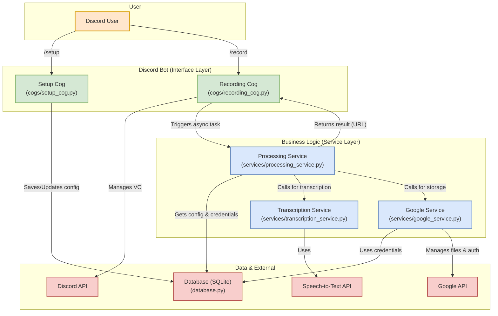

はい、マルチテナント展開を見据えたリファクタリングのご提案、素晴らしい着眼点です。現在の構成は単一サーバーでの運用を前提としているため、ご指摘の通り、設定のハードコーディングなどがスケーラビリティの課題となります。

永続化層の導入と責務の分離という方針は、保守性と拡張性を高める上で非常に的確です。その方針に基づき、現在のコードベースをレビューし、具体的なリファクタリング案を提案させていただきます。

### 現状のアーキテクチャレビュー

*   **密結合なコンポーネント**: `cogs/recording.py` が非常に多くの責務を担っています。Discordのコマンド処理、ボイスチャンネルの管理、録音ライフサイクルの制御、さらには文字起こしからGoogleドキュメントへの保存までの一連のタスクのオーケストレーションを単一のクラスで行っており、修正や機能追加が困難になる可能性があります。
*   **設定のハードコーディング**: ご指摘の通り、`main.py` の `ALLOWED_GUILD_ID` や `cogs/recording.py` の `GOOGLE_DOCS_FOLDER_ID` が固定値であるため、このままでは他のDiscordサーバーに導入できません。
*   **ステートレスではない認証管理**: 認証情報がサーバー（Guild）IDに基づいたファイル (`credentials-{guild_id}.json`) で管理されているようです。これはマルチテナントの基本的な要件を満たしていますが、設定情報（どのフォルダに保存するか等）はコード内にあり、永続化されていません。

### リファクタリング提案

現在のアーキテクチャをより疎結合でスケーラブルなものにするため、以下の構成を提案します。

#### 1. データベース層の導入 (永続化)

まず、サーバーごとの設定を管理するために、提案されている通りSQLiteを導入します。これにより、各サーバー（テナント）は自身の設定を持つことができます。

**`database.py` (新規作成)**
SQLiteデータベースへの接続とCRUD操作を抽象化するモジュールを作成します。

*   **`servers` テーブルスキーマ案:**
    *   `guild_id` (INTEGER, PRIMARY KEY): DiscordサーバーのID
    *   `gdrive_folder_id` (TEXT, NOT NULL): 保存先のGoogle DriveフォルダID
    *   `owner_id` (INTEGER): ボットを導入した管理者ユーザーID (設定変更の権限管理用)
    *   `language` (TEXT, DEFAULT 'ja'): 文字起こしに使用する言語設定など

*   **`credentials` テーブルスキーマ案:**
    *   `guild_id` (INTEGER, PRIMARY KEY, FOREIGN KEY): サーバーID
    *   `token` (TEXT): OAuthアクセストークン
    *   `refresh_token` (TEXT): リフレッシュトークン
    *   `token_uri` (TEXT)
    *   `client_id` (TEXT)
    *   `client_secret` (TEXT)
    *   `scopes` (TEXT)

    *注: 認証情報をDBに保存する場合、必ず暗号化してセキュリティを確保してください。*

#### 2. 責務の分離: Service層の導入

`utils` をより明確な責務を持つ `services` ディレクトリに再編し、ビジネスロジックをCogから分離します。

*   **`services/database_service.py`**: 上記の `database.py` をラップし、サーバー設定の取得や更新といった、よりビジネスロジックに近い機能を提供します。
*   **`services/google_service.py`**: `google_docs_utils.py` と `oauth_server.py` の機能を統合・リファクタリングします。サーバーIDを受け取り、DBから取得した認証情報と設定を用いてGoogle APIとのやり取りをすべて担当します。
*   **`services/transcription_service.py`**: `audio_transcription.py` の責務を引き継ぎます。
*   **`services/processing_service.py` (新規作成)**: これがリファクタリングの要です。録音後のバックグラウンド処理をすべて担当するオーケストレーターです。
    1.  `guild_id` と録音ファイルパスを受け取る
    2.  `TranscriptionService` を呼び出し、文字起こしを行う
    3.  `meeting_minutes.py` (これは`utils`に残しても良い) を使ってテキストを整形する
    4.  `GoogleService` を呼び出し、整形したテキストをGoogleドキュメントに保存する
    5.  結果（ドキュメントURLなど）を返す

#### 3. Discord Bot (Cog) の軽量化

上記の変更により、CogはDiscordとのインターフェースに専念できます。

*   **`cogs/recording_cog.py`**:
    *   責務: `/record_start`, `/record_stop` コマンドの受付、ボイスチャンネルへの接続・切断、録音ファイルの生成。
    *   録音終了後、`asyncio.create_task()` などを用いて **`services/processing_service.py`** の処理を **非同期で呼び出し**、自身はすぐにユーザーに応答を返します。「録音を終了しました。議事録の作成には数分かかります。完了したら通知します。」のように。
    *   `processing_service` から結果が返ってきたら、ユーザーにDMやチャンネル投稿で通知します。
*   **`cogs/setup_cog.py` (新規作成)**:
    *   `/setup` や `/config` といったコマンドを提供します。
    *   ユーザーがGoogle Driveの保存先フォルダIDなどを設定・変更できるようにします。変更内容は `DatabaseService` を通じてDBに保存されます。

### 新しいアーキテクチャの構成図

このリファクタリング案をコンポーネント図で示すと以下のようになります。

### まとめと次のステップ

このリファクタリングにより、各コンポーネントが単一の責務を持つようになり、コードの見通しが良く、テストや将来の機能追加が容易になります。また、サーバーごとの設定をデータベースで管理することで、完全なマルチテナント対応が実現できます。

**提案する具体的な作業手順:**

1.  `database.py` を作成し、DB接続とテーブル作成ロジックを実装する。
2.  `services` ディレクトリを作成し、既存の `utils` 内の各機能を責務に応じて新しいServiceモジュールへ移行・リファクタリングする。
3.  新しい `ProcessingService` を作成し、録音後の処理フローを実装する。
4.  `cogs/recording.py` をリファクタリングし、軽量化する。`ProcessingService` の非同期呼び出しを実装する。
5.  `cogs/setup_cog.py` を新規作成し、サーバー管理者が設定を行えるようにする。
6.  `main.py` からハードコードされた `ALLOWED_GUILD_ID` を削除し、DBの初期化処理などを追加する。

この計画について、ご意見や、さらに深掘りしたい点があればぜひお聞かせください。特定の箇所からリファクタリングに着手することも可能です。